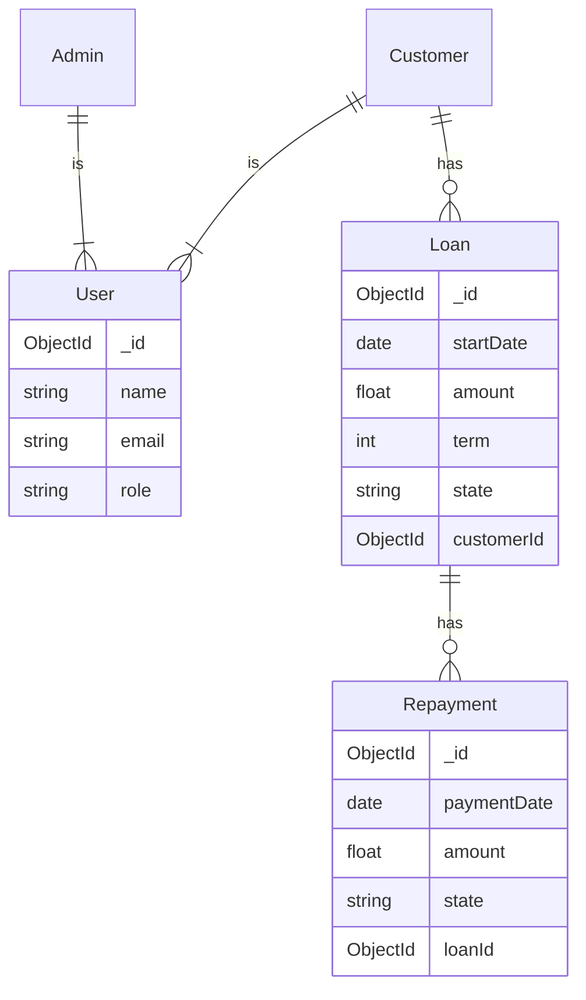

```mermaid
erDiagram
    User {
        ObjectId _id
        string name
        string email
        string role
    }

    Loan {
        ObjectId _id
        date startDate
        float amount
        int term
        string state
        ObjectId customerId
    }

    Repayment {
        ObjectId _id
        date paymentDate
        float amount
        string state
        ObjectId loanId
    }

    Admin ||--|{ User : "is"
    Customer ||--|{ User : "is"
    Customer ||--o{ Loan : "has"
    Loan ||--o{ Repayment : "has"
```
