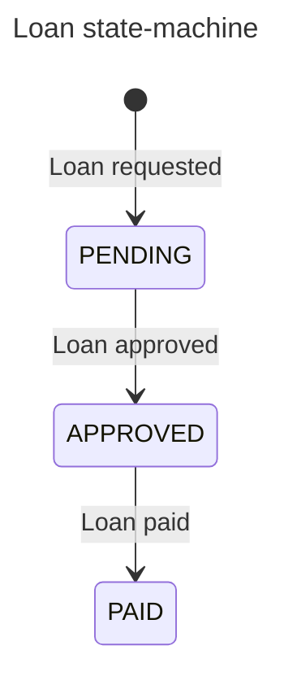
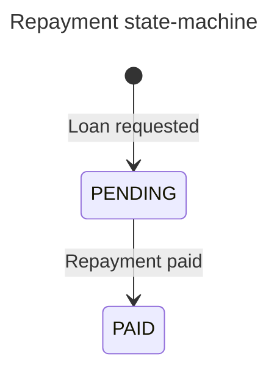

## Events

**Events:**

- Loan requested, triggered by Customer
- Loan approved, triggered by Admin
- Repayment of a loan paid, triggered by Customer
- Loan paid, triggered if every scheduled repayments of the loan are paid

## Subscribers of events

<u>**Notification service:**</u> a service to send emails to users of the application (not implemented). Subscribe to events:

- loan.requested: send an email to the admin to inform a loan has been requested
- loan.approved: send an email to the customer to inform the loan has been approved
- loan.paid: send an email to the admin and the customer to inform the loan is paid.

<u>**Payment reminder service:**</u> a service to schedule repayment to users (not implemented). Subscribe to events:

- loan.approved: schedule the payments reminders of the loan's terms.
- repayment.paid: cancel the payments reminders of the repayment paid

<u>**Loan service:**</u> a service which handles loans. Subscribe to events:

- repayment.paid: once a repayment is paid, we want to check if the whole loan is paid.

<u>**Repayment service:**</u> a service which handles repayments. Subscribe to events:

- loan.requested: once a repayment is requested, we want to create the repayments in the database.
- loan.approved: once a loan is approved, we want to authorize the repayments from the customer (maybe repayments need another state NOT_APPROVED ?).

<u>**Data service:**</u> a service owned by the data team which usually listen to every events. They project the data of events in a data lakehouse, and hence have the opportunity to provide strategic insight for the company building the app.

## State-machine of core objects

